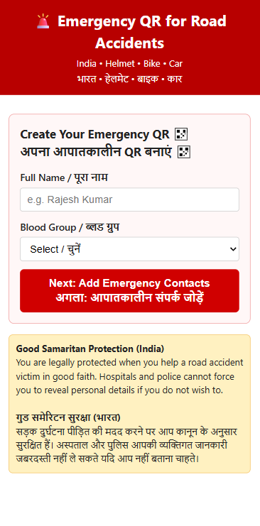

# JeevanQR


An emergency QR-based assistance platform that provides instant access to critical information during accidents. Scanning a user's QR gives first responders, bystanders, or family members quick access to emergency details, saved contacts, location data, and one-time incident photos so help can arrive faster.

Live Demo: https://jeevan-qr-5tb1.vercel.app/ (Hosted on Vercel)

---
---

## 🔖 Overview

**Your digital lifesaver in emergencies.** JeevanQR is a lightweight QR-based emergency assistance system. Scanning a user's QR opens an incident view with personal details, emergency contacts, location data and optional photos so helpers and responders can act quickly.

[Live Demo](https://jeevan-qr-5tb1.vercel.app/) • Deployed to Vercel

---

## ✨ Key Features

- QR-based emergency records (scan to view user info)
- Bilingual frontend (English + Hindi)
- One-tap calling of saved emergency contacts
- Quick access to government helplines
- Location sharing with incident reports
- Upload incident photos with one-time secure view links
- User privacy controls and delete-data support
- Serverless-friendly backend with lightweight JSON persistence

---

## 🛠 Tech Stack

- Backend: Python 3.12+, FastAPI (see `backend/`)
- Frontend: Static HTML, CSS, JavaScript (files in `frontend/`)
- Storage: JSON files and `uploads/` directory
- Deployment: Vercel (serverless) or any ASGI host (Uvicorn)

---

## 🚀 Run locally

1. Clone and enter the repo

```bash
git clone https://github.com/VanshRattan/JeevanQR.git
cd JeevanQR
```

2. Backend (FastAPI)

```bash
cd backend
python -m venv .venv
.venv\Scripts\activate   # Windows
# source .venv/bin/activate  # macOS / Linux
pip install -r requirements.txt
cp .env.example .env
uvicorn app.main:app --reload --port 3000
```

Open API docs: http://localhost:3000/docs

3. Frontend

```bash
# from repo root
npx http-server frontend -p 8080
# open http://localhost:8080
```

---

## 📸 Screenshots

Home / QR creation page (mobile)



Add more screenshots to `docs/screenshots/` and I will embed them.

---

## 🌱 Project Vision

JeevanQR shortens the time between a crash and help by surfacing the right details to the right people — fast, simply, and respectfully.

---

## 🧾 License

This repository is released under the MIT License — see `LICENSE`.

---

If you want, I can now:

- add `CONTRIBUTING.md` with a short contribution guide
- add a GitHub Actions workflow that runs `ruff` and `pytest` on push/PR
- add badges (build/test/coverage) to the README

Reply with which item to do next.

